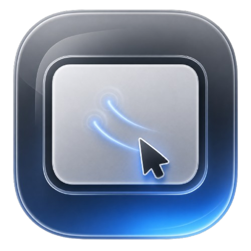

# Trackpad

<p align="center">
  
</p>

[中文](README.zh-CN.md) | [Français](README.fr.md)

Trackpad is a native Apple-platform project that lets an iPhone or iPad act as a macOS trackpad. The repository is intended to live at:

```text
git@github.com:AielloChan/trackpad.git
```

The current milestone is a local-network MVP. The iOS app provides a black full-screen touch surface, captures multi-touch input, normalizes it into platform-neutral events, and sends those events to a macOS host app. The macOS host advertises itself over Bonjour, accepts a paired client connection, maps incoming events to macOS input commands, and injects pointer, click, drag, and scroll events through system APIs.

## Current Status

Phase 1 is functionally usable for local LAN testing:

- iOS/iPadOS client with a black touch surface.
- Bonjour discovery and manual IP connection fallback.
- QR-code pairing from the macOS host app to the iOS client.
- Six-digit pairing gate before input is processed.
- Single-finger pointer movement.
- Single-finger tap for left click.
- Tap, quick second press, and movement for drag.
- Two-finger tap for right click.
- Two-finger scroll without client-generated inertial momentum.
- Three-finger swipe up/down/left/right for Mission Control, App Expose, and Spaces navigation, gated by the host Mac's current three-finger trackpad settings.
- Client-side latency, touch sample rate, and sent event rate display.
- Active connection path display for Wi-Fi, cellular, wired/cable-like, and constrained paths.
- Initial wired-only TCP connection attempt before default TCP fallback when the system exposes a cable-like path.
- Live tuning sliders for pointer speed and gesture timing.
- iOS sends high-frequency input as compact HID-like 32-byte binary reports.
- Pending pointer and compatible scroll changed reports are coalesced while a previous send is still in flight.
- macOS host input injection for movement, click, drag, scroll phase, momentum phase, and double-click click state.
- macOS host accepts binary input reports and JSON control frames on the same session stream.
- Persistent macOS host logs at `~/Library/Logs/Trackpad/host.log`.
- Host-triggered iOS/iPadOS diagnostic log uploads to `~/Library/Logs/Trackpad/client-logs/`.

The goal is to keep improving the feel until it is as close as practical to the official Apple trackpad experience. Stage 1 still has manual verification items in `TODOS.md`, especially real-device gesture tuning and safe click/scroll checks.

## Repository Layout

```text
apps/
  ios/
    TrackpadIOS/          iOS/iPadOS app target.
    TrackpadIOSCore/      Reusable iOS gesture and client logic.
  macos/
    TrackpadHost/         macOS host Swift package and CLI.
    TrackpadHostApp/      Native macOS host app.

packages/
  TrackpadKit/            Shared protocol, transport, security, and platform-neutral models.

protocol/
  v1/                     Protocol documentation.
    wire-protocol.md      Detailed v1 wire protocol specification.

docs/
  architecture.md         System architecture.
  decisions/              Architecture decision records.
  ios-client-mvp.md       iOS MVP notes and verification history.
  macos-host-mvp.md       macOS host notes and verification history.

plans/
  *.md                    Implementation plans with progress tracking.

TODOS.md                  Current project tracker.
AGENTS.md                 Coding-agent instructions for this repository.
```

## Architecture

Trackpad is a two-sided control system:

```text
iPhone / iPad
  -> captures touches
  -> normalizes gestures
  -> sends TrackpadProtocol input events

macOS host
  -> receives session frames
  -> checks pairing
  -> maps events into macOS input commands
  -> injects CGEvent input
```

The shared protocol is the boundary between clients and hosts. iOS touch details should not leak into the macOS input layer, and macOS injection details should not leak into the iOS gesture mapper.

Transport is intentionally abstracted. The MVP uses Bonjour plus direct TCP on the local network. Future versions can add WebRTC-style NAT traversal, relay fallback, Android clients, and Windows hosts without changing the core input-event model.

## Requirements

- macOS with Xcode installed.
- Swift toolchain provided by Xcode.
- iPhone/iPad or iOS Simulator for the client. QR scanning requires a real device with camera permission.
- Accessibility permission granted to the running macOS host app or host CLI before input injection can work.
- Automation permission granted for `TrackpadHostApp` to control `System Events` before three-finger left/right Space navigation can work.

## Build and Run

### macOS Host App

Open and run:

```text
apps/macos/TrackpadHostApp/TrackpadHostApp.xcodeproj
```

Use the `TrackpadHostApp` scheme. The app shows a pairing QR code, current pairing code, server state, port, connection count, and Accessibility permission state.

Command-line build:

```bash
xcodebuild -project apps/macos/TrackpadHostApp/TrackpadHostApp.xcodeproj -scheme TrackpadHostApp -configuration Debug build
```

### macOS Host CLI

```bash
cd apps/macos/TrackpadHost
swift run TrackpadHost status
swift run TrackpadHost request-permission
swift run TrackpadHost log-path
swift run TrackpadHost serve 123456
```

Local debug actions:

```bash
swift run TrackpadHost move-test
swift run TrackpadHost left-click-test
swift run TrackpadHost right-click-test
swift run TrackpadHost scroll-test
```

Run click and scroll debug actions only in a safe empty UI area.

### iOS Client

Open and run:

```text
apps/ios/TrackpadIOS/TrackpadIOS.xcodeproj
```

Use the `TrackpadIOS` scheme on a simulator or real device. A real iPhone or iPad is required for QR scanning and meaningful touch-feel testing. Tap `Scan QR` on the connection panel to pair with the macOS host QR code, or use Bonjour/manual IP fallback.

Command-line simulator build example:

```bash
xcodebuild -project apps/ios/TrackpadIOS/TrackpadIOS.xcodeproj -scheme TrackpadIOS -configuration Debug -destination 'platform=iOS Simulator,name=iPhone 17' build
```

## Test

Run shared package tests:

```bash
cd packages/TrackpadKit
swift test
```

Run macOS host tests:

```bash
cd apps/macos/TrackpadHost
swift test
```

Run iOS core tests:

```bash
cd apps/ios/TrackpadIOSCore
swift test
```

## Roadmap

Near-term work:

- Finish real-device gesture tuning against Apple trackpad behavior.
- Continue tuning report coalescing, sample rate, and pointer/scroll feel on real devices.
- Validate cable-like network paths on real USB-connected devices and prepare transport migration.
- Persist trusted devices and improve pairing UX.
- Add encrypted sessions.

Longer-term work:

- Remote connectivity with signaling, NAT traversal, and relay fallback.
- Android client.
- Windows host.
- Cross-platform protocol schema generation.

## Development Process

`TODOS.md` is the active progress source. `plans/*.md` are the implementation source for scoped work. Important architecture decisions belong in `docs/decisions/`.

Coding agents and contributors should read `AGENTS.md` before editing. The project favors small, readable files, reusable platform-neutral logic, and tests for protocol encoding, gesture state machines, event mapping, and transport behavior.
